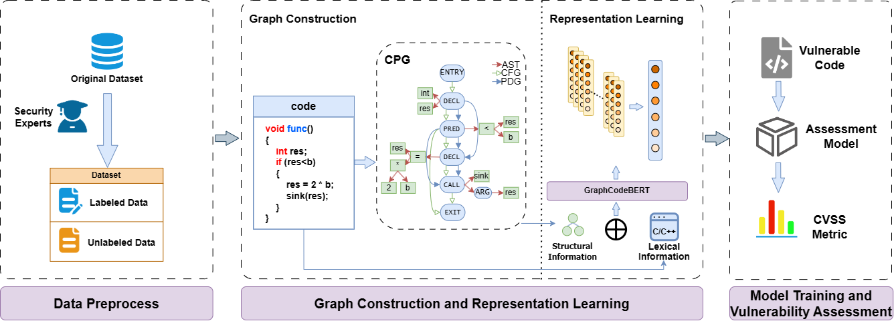
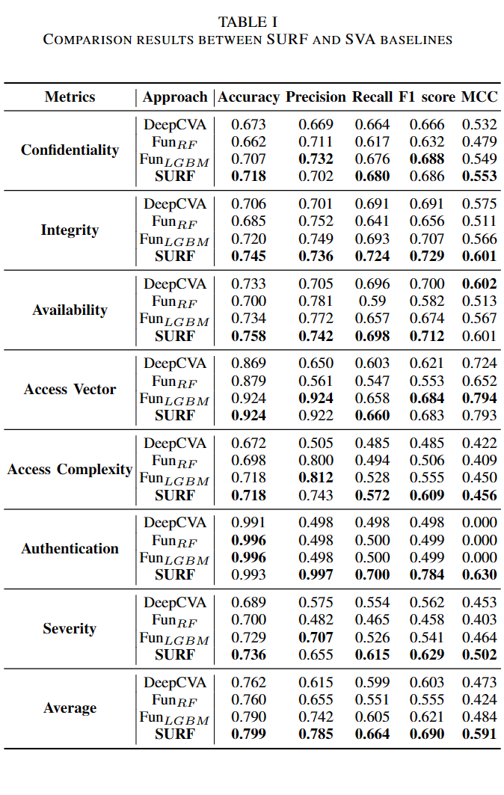
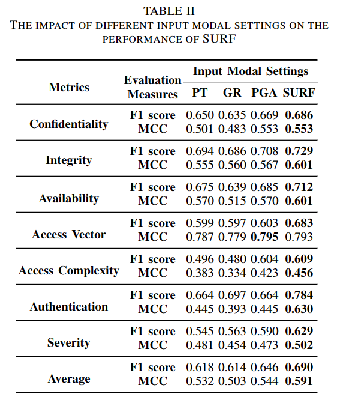
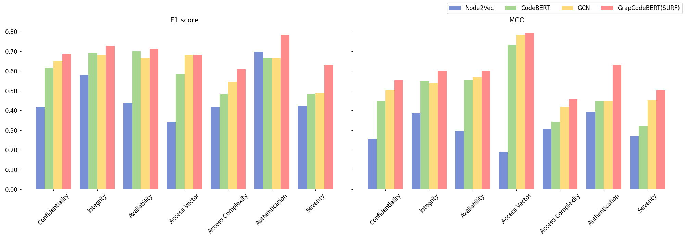

# SURF

 

Unleashing Unlabeled Data: Semi-Supervised Software Vulnerability Assessment via Code Lexical and Structural Information Fusion

### Dataset preparation

You can download the preprocessed dataset from [here](*https://drive.google.com/file/d/1gMUqkgg0JkfgC5EZFZWBSrcOXD2bvYKn/view?usp=sharing*) and move it to `data`. 

If you would like to obtain more information about the dataset, please refer to `data/readme.md`

### Requirements

Environment can be set up by running the following command in the root directory of the project:
``` conda env create -f environment.yaml ```

### Run

Here is our [training script](./approach/run.py), you can run it to train your semi-supervised vulnerability assessment model.

If you want to download our model we trained, please click [here](https://drive.google.com/file/d/1FC7fMrHTSo52OAmWy2QnhxA1PXl-jWsx/view?usp=sharing).

### Results

We provide a brief analysis of RQ. 

If you want to see more detail, please see the paper.

#### RQ1

We consider comparing the scenario where SURF only uses 30% label SVA data with the scenario where these two baselines use 100% label SVA data. 



#### RQ2

We designed this RQ to investigate the impact of different input modal settings (such as only considering the code as plain text, only considering the code as CPG or bimodal input by further considering the code as abstract syntax tree) on the performance of SURF.



#### RQ3

We select the most representative methods for each category, including Node2Vec, CodeBERT and GCN and design this RQ to analyze whether using GraphCodeBERT can achieve the best performance for SURF.




